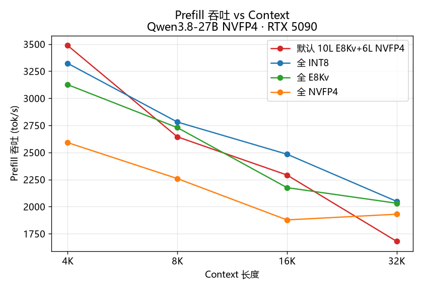
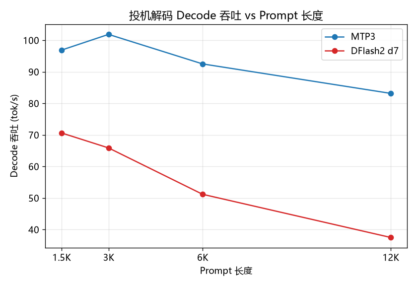
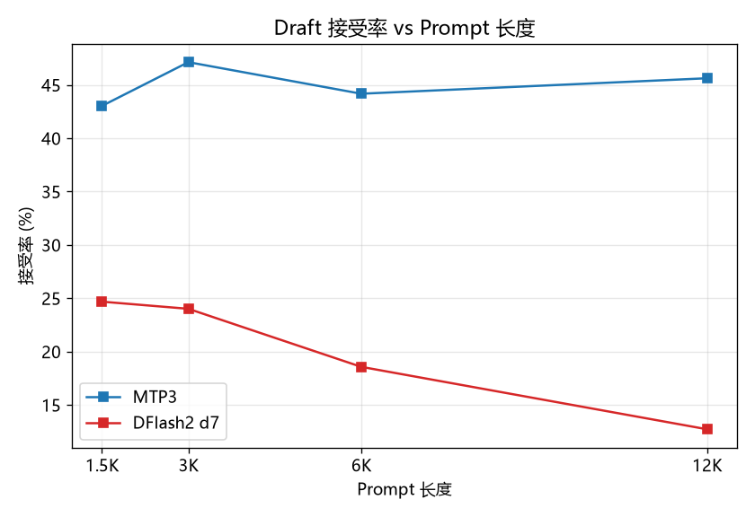

# NInfer Fusion（增强补丁集）

基于 [Neroued/ninfer](https://github.com/Neroued/ninfer)（Apache-2.0）的社区增强发行版：把 KV 压缩、冷层、投机解码、长上下文能力合并为单一可维护补丁集，面向 RTX 5090 / sm_120a。

> 全部性能/精度数据均为本项目在 RTX 5090D + WSL2（CUDA 13.3, sm_120a）上的实测结果。

## 实测数据（Qwen3.8-27B NVFP4, 4096 ctx, 13.3k zh 语料）

### KV 量化方案 ppl + prefill（ninfer-perplexity 实测）

| 配置 | ppl | NLL | prefill tok/s |
|---|---|---|---|
| **10L E8 + 6L NVFP4（默认）** | **1.0202** | 0.020 | **2027.7** |
| all-E8（16 层全 E8-lattice） | 1.1120 | 0.106 | 2082.7 |
| 全 NVFP4（E2M1 K + ISO3 V） | 1.7055 | 0.534 | 1949.1 |
| 全 int8（参考） | 1.5217 | 0.420 | 2017.2 |
| 旧默认（10L NVFP4 + 6L I8） | 1.2962 | 0.259 | — |

默认配置 10L E8 + 6L NVFP4 同时赢精度与速度：E8-lattice K 提供格点增益（H64 旋转对齐 g64 scale 域），NVFP4 层的 ISO3 V 比 i4 更贴值分布。

### 速度曲线（RTX 5090D 实测，2026-09-02）

Prefill 吞吐 vs Context（ppl score rate，corpus-long 多窗口）：



投机解码（MTP3 / DFlash2 d7）随 Prompt 长度的 Decode 吞吐与 Draft 接受率：





| Prompt | MTP3 接受率 | DFlash2 接受率 | MTP3 decode | DFlash2 decode |
|---|---|---:|---:|---:|
| 1.5K | 43.0% | 24.7% | 96.9 tok/s | 70.6 tok/s |
| 3K | 47.1% | 24.0% | 101.9 tok/s | 65.9 tok/s |
| 6K | 44.2% | 18.6% | 92.5 tok/s | 51.2 tok/s |
| 12K | 45.6% | 12.7% | 83.2 tok/s | 37.5 tok/s |

### 容量（每 head/token）

| 方案 | 字节 | bit/元素 |
|---|---|---|
| E8Kv（E8 K + i4 V, g64） | ≈260 B | ≈4.06 |
| NVFP4（E2M1 K + ISO3 V, g16） | 288 B | 4.50 |
| int8（参考） | 512 B | 8.00 |

### 历史修复记录

- E8Kv 精度根因修复：旧实现无旋转/无 E8 投影 + scale 误用 /127（K/V 幅值缩小 18 倍）→ ppl 6.91；修复后（H64 + 投影 + /7）→ **1.11**。
- 上游 nvfp4 的 represented-scale 补偿尝试使 baseline 恶化（2.65），已回滚并记录，待重做验证。

## 功能清单

| 功能 | 开关 | 说明 |
|---|---|---|
| 分层位宽表 | `--kv-layer-storage` | 16 层逐层 BF16/INT8/NVFP4/E8Kv 混合 |
| E8Kv 4-bit 整 KV | `--kv-layer-storage all:e8` | E8-lattice K + i4 V（H64 旋转对齐 g64） |
| NVFP4-tier KV | `--kv-dtype nvfp4` / 层表 | E2M1 K + ISO3 V，原生 mxf4nvf4 QK |
| 熵编码冷池 | `--cold-policy window` | rANS slot 压缩冷页（I8 层） |
| NVMe 冷层 | `--cold-policy disk` | 冷页 spill 到磁盘（文件槽，默认关） |
| DFlash2 草稿 | `--spec dflash2` | 双向注意力草稿 + 长度切换 |
| on-demand Graph | `--graph-capture-ceiling N` | 解码 ladder 按需扩展 |
| YaRN factor-4 | `--yarn` | 静态 4x 上下文扩展 |
| 自动前缀共享 | serve 默认（`--no-auto-system-shared-prefix` 关闭） | system/developer 边界自动建共享前缀（issue #142） |

## 已知限制

- 残差平面（`--kv-residual-layers`）：block_tables 破坏未定位（实验功能，默认关）。
- 冷池只覆盖 I8 层（E8Kv/NVFP4 安全跳过）。
- MTP KV 使用全局 dtype（分层表不影响 MTP）。

## 构建

### WSL2（主平台）

```bash
cmake -B build -DCMAKE_BUILD_TYPE=Release \
  -DCMAKE_CUDA_COMPILER=/usr/local/cuda-13.3/bin/nvcc \
  -DCMAKE_CUDA_ARCHITECTURES=120a
cmake --build build -j
```

### Windows 原生（适配分支）

见 [Astrangemaninhere/ninfer-5090-windows](https://github.com/Astrangemaninhere/ninfer-5090-windows)
（fork 自 headpiece747 的 MSVC 移植，已同步本项目的 KV 功能）。

## 版权

Apache-2.0。第三方贡献与归属见 [THIRD-PARTY.md](THIRD-PARTY.md)：
E8 codec 血统（PR #35 → ninfer-4090 → ninfer-3090）、IsoQuant 表（nvfp4rtx 校准）。
